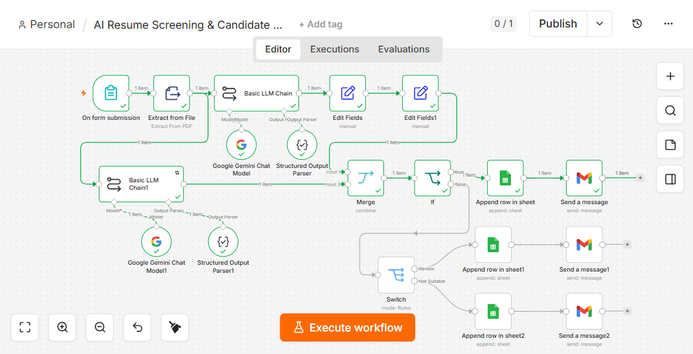
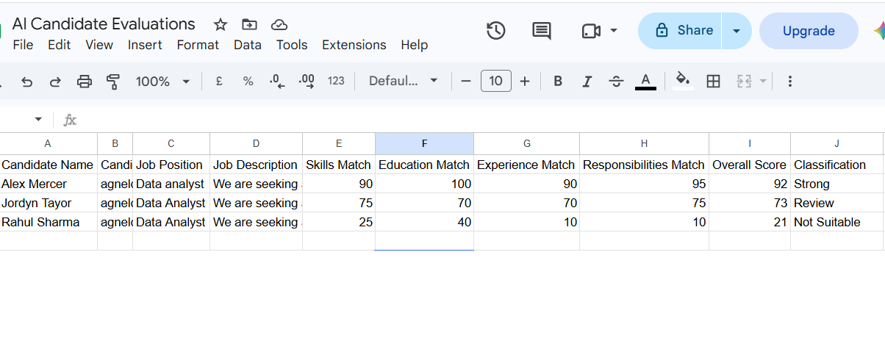

# AI Resume Screening & Candidate Ranking System

## Overview

This project is an automated workflow that screens resumes and ranks candidates against a job description, without a human needing to read every resume manually. A candidate submits their resume through a form, and the system scores, classifies, and routes the result — sending it to the right Google Sheet and email — all automatically.

Built as the assigned project for an Agentic AI certification course. The professor provided the required project structure; the design decisions, configuration, and testing were carried out independently, using ChatGPT as a step-by-step guide throughout the build.

## Tech Stack

- **n8n** (workflow automation platform, local instance, v2.32.5)
- **Google Gemini** (gemini-3.1-flash-lite) — for resume scoring and evaluation
- **Google Sheets** — for storing candidate evaluation results
- **Gmail** — for automated email notifications

## How It Works

1. **Form submission** — a candidate's resume is submitted through an n8n Form.
2. **Text extraction** — the resume file is processed with n8n's Extract From File node to pull out the raw text.
3. **AI scoring (first pass)** — Gemini scores the resume across four dimensions, each from 0–100:
   - Skills
   - Education
   - Experience
   - Responsibilities
4. **Structured parsing** — a Structured Output Parser converts Gemini's response into a clean, structured format the workflow can use.
5. **Weighted overall score (deterministic)** — rather than letting the AI decide the final score directly, the workflow calculates it using a fixed formula:
   - Skills: 40%
   - Experience: 30%
   - Responsibilities: 15%
   - Education: 15%
6. **Classification (deterministic)** — based on the weighted score:
   - **Strong**: 80–100
   - **Review**: 60–79
   - **Not Suitable**: 0–59
7. **AI evaluation (second pass)** — a second Gemini call generates a descriptive, human-readable evaluation explaining the candidate's fit.
8. **Merge and route** — the numeric result and the descriptive evaluation are merged, then routed using If/Switch logic:
   - Each classification is logged to its own section in Google Sheets.
   - Automated Gmail notifications are sent depending on the classification.

## Workflow Diagram

## Sample Results

Three test resumes were run against the same job description in a single consistent test run:

| Candidate       | Weighted Score | Classification |
|------------------|:--------------:|-----------------|
| Alex Mercer      | 92             | Strong           |
| Jordyn Taylor    | 73             | Review           |
| Rahul Sharma     | 21             | Not Suitable     |

Results are logged to a Google Sheet ("AI Candidate Evaluations", tab "Candidates") with 18 tracked columns per candidate.

## Key Design Decisions

- **Deterministic scoring, not AI-decided scoring**: the final weighted score and classification are calculated with a fixed formula rather than asking the AI to output a final score directly. This keeps the ranking consistent and explainable — the same inputs always produce the same output, and the logic can be audited or adjusted without retraining or re-prompting the AI.
- **Two separate AI calls**: one call handles objective scoring (the four dimensions), and a second, separate call handles the descriptive write-up. Splitting these keeps the numeric scoring focused and free of unnecessary narrative influence.
- **Fairness by design**: the scoring prompt explicitly instructs the AI to exclude protected and irrelevant characteristics from evaluation, so ranking is based only on job-relevant criteria.

## Notes

This project was built and tested locally in n8n. All credentials referenced in the exported workflow file are safe ID/name references only — no actual credential data is included in this repository.
